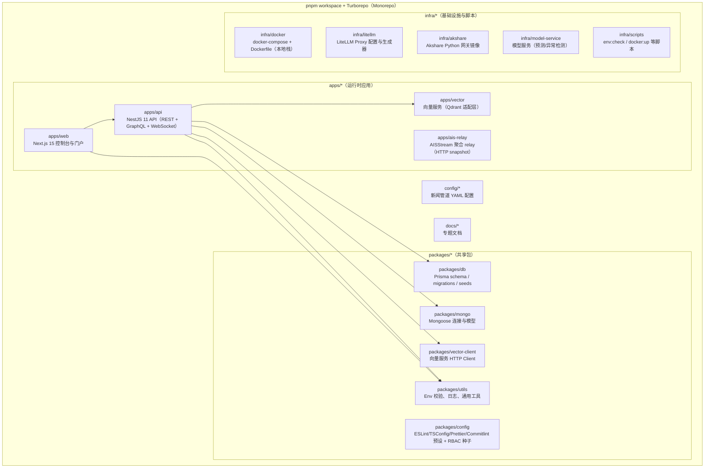
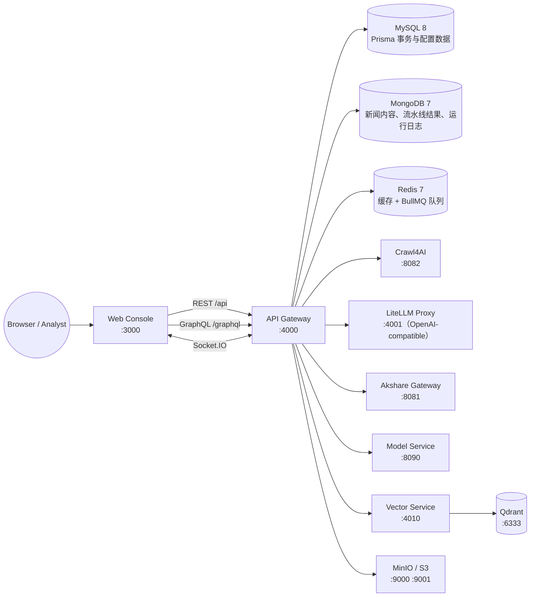

# Modular Monolith（全球态势感知与新闻情报分析平台）

一句话定位：一个面向组织的全球态势感知与新闻情报分析平台，通过“采集 → 清洗 → 结构化 → 关联 → 检索 → 可视化 → 实时推送”闭环，把新闻与事件数据转化为可查询、可解释、可运营的情报资产。

核心价值主张：

- 将多源新闻聚合、抓取与 LLM 清洗流水线整合为统一管道
- 将事件、实体、关系与影响链沉淀为知识图谱与影响分析
- 提供面向运营与分析的控制台、实时信号与可视化看板

## 目录

- [系统架构](#系统架构)
- [功能特性](#功能特性)
- [采集策略](#采集策略)
- [技术栈与选型理由](#技术栈与选型理由)
- [快速开始](#快速开始)
- [常用命令](#常用命令)
- [项目结构](#项目结构)
- [配置指南](#配置指南)
- [AIS Relay](#ais-relay)
- [并发控制说明](#并发控制说明)
- [API 文档入口](#api-文档入口)
- [开发规范](#开发规范)
- [部署与运维](#部署与运维)
- [贡献指南](#贡献指南)
- [更新日志](#更新日志)
- [开源复用声明（NewsNow）](#开源复用声明newsnow)

## 系统架构

### Monorepo 结构图



### 运行时组件图（本地 Docker Compose 默认）



## 功能特性

以下能力均可在代码中对应到 `apps/api/src/modules/*` 与 `apps/web/app/*` 的实现。

### 📊 新闻管道系统（采集、清洗、结构化、去重）

- 新闻源聚合与预置源：`news-aggregator`（多站点适配器 + NewsNow 实时分发）
- 抓取编排与结果存档：`crawl`（任务、重试、质量指标、媒体抓取、OPML/RSS 工具链）
- LLM 清洗与结构化：`news-pipeline`（LiteLLM OpenAI-compatible 接口，支持摘要、要点、主题、实体等结构化产物）
- 语义去重与检索：对接 `apps/vector`（Qdrant）并提供回填脚本 `pnpm --filter @modular/api run vector:backfill`

## 采集策略

### Seed-first + LLM-assisted Frontier

新闻采集默认采用 `Seed-first, Frontier-second, LLM-adaptive` 双通道策略：

- 大站优先走 `robots.txt -> news sitemap / sitemap index -> sitemap common paths`，先拿高价值文章种子，再进入正文抓取。
- 同时保留轻量 `home/category/list` 拓扑通道，用于栏目学习、站点漂移检测、导航 lineage 和 DOM scope 自学习。
- 当 sitemap 不可用、质量差、或站点结构漂移时，系统自动回退到 `LLM-assisted frontier V1`，通过 `rule -> rerank -> LLM judge` 自适应识别 `home/category/list/article`。

这意味着系统并不依赖单一策略：

- `Reuters / Arc CMS` 这类大站，优先从 `robots.txt` 暴露的 `news-sitemap-index` 获取新闻文章，再用 frontier 做结构校验和补充。
- `BBC / Guardian / AP / Al Jazeera` 这类开放门户，可以同时利用 seed 与 frontier，降低纯 deep crawl 成本并保留栏目结构发现。
- 小站、国别门户、无 sitemap 站点、结构漂移站、反爬重站，`LLM-assisted frontier V1` 会成为主路径；即使没有标准列表页，也允许 `synthetic list` 语义来维持四层导航与文章发现。

实现约束也保持清晰：

- 与 Crawl4AI 的交互仍然是 `HTTP REST /crawl`，不直接调用 Python SDK。
- Crawl 阶段禁止 LLM extraction；LLM 只用于 frontier 判别、站点学习、以及 post-crawl 抽取修复。
- `news-source` 的 `sitemap/rss/list/deep` 种子发现，与 `crawl-frontier` 的 layered/native/hybrid 运行共享同一套去重、诊断和 profile 学习逻辑。

### 🌍 态势监控（全球事件追踪与可视化）

- 态势洞察聚合：`situation-monitor`（分类、叙事模式、相关性、主角实体、告警关键词等）
- 外部数据兜底与翻译：支持 GDELT 兜底与翻译 API（见 `SITUATION_MONITOR_*` 配置）；本地 Docker/WSL 下的 GDELT IPv4 兼容兜底说明见 [docs/gdelt-ipv4-fallback.md](./docs/gdelt-ipv4-fallback.md)
- 地理与地图图层：`geo`、`dashboard`（含世界地图资产与传播/时空热力相关图表服务）

### 🧠 知识图谱（实体关系、证据与审核）

- 实体/关系写入与查询：`knowledge-graph`（Prisma 存储 `KnowledgeEntity/KnowledgeEdge`，支持证据绑定）
- 实体消歧：`knowledge-graph-entity-disambiguation`（在上下文文本中从候选中挑选实体）
- 审核队列：`knowledge-graph-review`（证据审核队列接口与列表）

### 📈 影响图（影响链解释与场景化分析）

- 知识图谱影响分析：`knowledge-graph-impact`（例如高管变动、商品波动、政策事件的影响候选与解释链）
- 实体影响传播图：`dashboard/entity-impact-graph`（用于前端实体影响图面板与传播可视化）

### 💡 情感分析（实体/主题情感快照）

- 情感快照查询：`sentiment`（按实体、主题维度提供时间窗口快照查询）
- 快照入库：`sentiment-snapshot.ingestion`（用于定时/任务生成情感桶）

### 🎯 智能助手（AI 驱动的问答、报告与预测）

- 任务式助手：`assistant`（Query / Report / Forecast 三类运行，BullMQ 异步处理）
- 安全护栏：支持通过 LiteLLM Guardrails 做输入安全检查（见 `ASSISTANT_GUARDRAILS*`）
- 知识来源：支持站内数据（site_db）与可选 Web Search（需 LLM Gateway Profile 支持）

### 🔄 实时信号（WebSocket 实时推送）

- Socket.IO 网关：`queue/notifications/observability/newsnow` 等模块提供实时事件推送
- 横向扩展：可启用 Socket.IO Redis adapter（`WS_REDIS_ADAPTER_ENABLED`）

### 👤 用户行为（个性化偏好画像）

- 行为记录：`user-news-behavior`（view/click/bookmark 等权重事件写入 Redis）
- 偏好画像：按来源、主题、实体、域名、事件等维度生成可用于推荐/排序的 Profile

## 技术栈与选型理由

### 技术栈（来自 `package.json` 与代码依赖）

- 前端：Next.js 15（App Router）、React 19、TypeScript、Tailwind CSS、Ant Design、Apollo Client、GraphQL Code Generator、ECharts、Three.js、TanStack Query、Zustand、NextAuth（Auth.js）
- 后端：NestJS 11、GraphQL（Apollo / code-first）、OpenAPI/Swagger、Prisma（MySQL）、Mongoose（MongoDB）、BullMQ（Redis）、Socket.IO
- AI/数据：LiteLLM Proxy（OpenAI-compatible 网关）、Qdrant（向量检索）、向量服务（独立内网鉴权）
- 工具链：pnpm workspace、Turborepo、ESLint + Prettier、Commitlint（Conventional Commits）

### 为什么选择 NestJS + Next.js +（MySQL + MongoDB）

- NestJS：模块化边界清晰，适合“模块化单体”落地，天然支持 GraphQL/Swagger/队列/WebSocket
- Next.js：同一代码库同时承载管理控制台与阅读门户，SSR/路由分组对运营场景友好
- MySQL + Prisma：用于强一致的组织/用户/RBAC/系统设置等核心配置与事务数据，迁移与事务可控
- MongoDB + Mongoose：用于抓取内容、流水线结果、运行日志等高变更/半结构数据，写入与迭代成本低

## 快速开始

### 环境要求

- Node.js `>= 20`
- pnpm `9.x`（建议使用 Corepack）
- Docker + Docker Compose

### 方式 A：一键启动完整本地栈（推荐）

```bash
cp .env.example .env
cp infra/docker/.env.sample infra/docker/.env

pnpm install
pnpm prepare
pnpm --filter infra-scripts run env:check

pnpm docker:up
pnpm db:migrate
pnpm db:seed
```

访问入口：

- Web 登录页：http://localhost:3000/login
- Web Crawl4AI 监控页：http://localhost:3000/admin/ops/crawl-monitor
- API 健康检查：http://localhost:4000/api/healthz
- Swagger UI：http://localhost:4000/docs
- GraphQL Playground（开发环境）：http://localhost:4000/graphql
- Bull Board 队列仪表盘：http://localhost:4000/admin/queues
- Crawl4AI Dashboard：http://localhost:8082/dashboard/
- LiteLLM Proxy（宿主机端口）：http://localhost:4001
- MinIO S3 Endpoint：http://localhost:9000
- MinIO Console：http://localhost:9001

### 方式 B：API/Web 本地跑，依赖用 Docker

此方式适合更快的热更新与调试（API/Web/Vector 跑在宿主机，MySQL/Mongo/Redis/Qdrant/MinIO/Crawl4AI/LiteLLM 等跑在 Docker）。

```bash
cp .env.example .env
cp infra/docker/.env.sample infra/docker/.env

pnpm install
pnpm --filter infra-scripts run env:check

# 只起依赖服务，避免与宿主机的 api/web/vector 端口冲突
pnpm docker:up -d mysql mongo redis qdrant minio minio-init crawl4ai litellm akshare model-service

pnpm db:migrate
pnpm db:seed
pnpm dev
```

补充说明：

- Docker 方式下建议保持 `infra/docker/.env` 中的 `CRAWL4AI_SSRF_PROXY_URL=http://127.0.0.1:18080`。这会让 Crawl4AI worker 在实际抓取时通过本地 SSRF 代理完成 DNS 解析和内网地址阻断，而不是只依赖 API 入口处的预检。
- Web 管理页 `http://localhost:3000/admin/ops/crawl-monitor` 与抓取任务页内置的 Crawl4AI 状态卡会显示 `SSRF proxy OK / FAILED / OFF`。如果这里显示 `OFF`，说明部署没有启用 worker 侧 DNS rebinding 防护。
- `situation-monitor` / `realtime-signals` 在本地 Docker、WSL、双栈 DNS/出口不稳定环境中访问 `api.gdeltproject.org` 失败时，会只对该主机做一次 IPv4 重试；这不是全局网络策略，详见 [docs/gdelt-ipv4-fallback.md](./docs/gdelt-ipv4-fallback.md)。
- 生产环境建议在首次部署或引入新索引后显式执行一次 `pnpm mongo:indexes`，避免在关闭 `autoIndex` 的环境里漏掉 `ProcessedItem` 或 `TaskLog` 的新索引。

### 种子数据（首次必填）

`pnpm db:seed` 会读取根目录 `.env` 中的 `SEED_*` 创建组织与初始管理员：

- `SEED_ORG_SLUG`、`SEED_ORG_NAME`（可选 `SEED_ORG_DESCRIPTION`）
- `SEED_ADMIN_EMAIL`、`SEED_ADMIN_PASSWORD`、`SEED_ADMIN_FIRST_NAME`、`SEED_ADMIN_LAST_NAME`

## 常用命令

| 命令                                                       | 说明                                                                                |
| ---------------------------------------------------------- | ----------------------------------------------------------------------------------- |
| `pnpm dev`                                                 | Turbo 并行启动 `apps/api`、`apps/ais-relay`、`apps/web`、`apps/vector` 的开发服务器 |
| `pnpm build`                                               | Turbo 构建所有包                                                                    |
| `pnpm lint` / `pnpm typecheck` / `pnpm test`               | 汇总执行 lint、类型检查与测试                                                       |
| `pnpm db:migrate`                                          | 通过 `packages/db` 执行 Prisma 迁移                                                 |
| `pnpm db:seed`                                             | 根据 `.env` 的 `SEED_*` 初始化组织、角色与管理员账号                                |
| `pnpm mongo:indexes`                                       | 显式补齐 Mongo 运行时索引（当前包含 `ProcessedItem` 与 `TaskLog` 热路径索引）       |
| `pnpm docker:up` / `pnpm docker:logs` / `pnpm docker:down` | 本地完整栈（Docker Compose）                                                        |
| `pnpm codegen`                                             | 运行 GraphQL Code Generator（使用 `apps/web/codegen.yml`）                          |

## 项目结构

目录树（核心）：

```text
.
├─ apps/
│  ├─ api/                 NestJS API（REST / GraphQL / WS）
│  ├─ web/                 Next.js 控制台与门户（App Router）
│  └─ vector/              向量服务（Qdrant 适配层，内网鉴权）
├─ packages/
│  ├─ config/              ESLint/TSConfig/Prettier/Commitlint 预设 + RBAC 种子
│  ├─ db/                  Prisma schema、迁移、seed 脚本
│  ├─ mongo/               Mongoose 模型与连接
│  ├─ utils/               Zod env 校验、日志、通用工具
│  └─ vector-client/       向量服务客户端（x-internal-token）
├─ infra/
│  ├─ docker/              docker-compose、Dockerfile、infra/docker/.env.sample
│  ├─ litellm/             LiteLLM 配置与生成器
│  ├─ akshare/             Akshare 网关镜像构建
│  ├─ model-service/       模型服务镜像构建
│  └─ scripts/             docker:up、env:check、redis AOF 修复等
├─ config/                 新闻管道 YAML 配置（本地与 Docker 两套）
├─ docs/                   专题文档
├─ .env.example            根目录环境变量模板（用于 seed/db 脚本）
├─ pnpm-workspace.yaml
└─ turbo.json
```

关键入口文件：

- `apps/api/src/main.ts`：REST 全局前缀 `/api`、Swagger `/docs`、CORS、Socket.IO Redis adapter
- `apps/api/src/graphql/graphql.module.ts`：GraphQL code-first 生成 `apps/api/schema.gql`，并配置复杂度/深度限制
- `apps/ais-relay/src/index.ts`：AISStream WebSocket 聚合为 `/ais/snapshot`、`/health` 和 `/healthz/live` 的轻量 relay
- `apps/web/app/`：Next.js App Router 路由组（`(app)` 控制台、`(portal)` 门户、`(reader)` 阅读器、`(auth)` 登录）
- `infra/docker/docker-compose.yml`：本地完整栈服务定义与端口映射
- `config/news-pipeline.config.yaml`：新闻清洗管道配置（本地）
- `config/news-pipeline.config.docker.yaml`：新闻清洗管道配置（Docker）

## 配置指南

### 环境变量文件分层

- 根目录 `.env`：主配置来源；用于 `pnpm db:migrate` / `pnpm db:seed` 等宿主机脚本，也会作为 API / Web / Vector 本地运行时的默认 fallback
- `apps/api/.env`、`apps/web/.env`：可选覆盖层；仅在你需要给单个应用覆盖根目录 `.env` 的值时再创建
- `infra/docker/.env`：用于 Docker Compose（服务间访问使用容器域名如 `mysql`、`redis`、`api`）

数据源约定：

- 宿主机运行时可直接设置 `DATABASE_URL`，否则 API / Prisma / db 脚本会回退到 `MYSQL_*`
- Docker Compose 仍依赖 `infra/docker/.env` 中的 `MYSQL_*` 初始化 MySQL 容器，因此不要只保留 `DATABASE_URL`

校验配置：

```bash
pnpm --filter infra-scripts run env:check
```

该检查当前也会覆盖 AIS relay 相关配置，包括 `REALTIME_SIGNALS_AIS_*`、`AISSTREAM_URL`、`AISSTREAM_API_KEY`、`AIS_RELAY_SHARED_SECRET` 与健康阈值类变量。

### 关键配置项速览

- 数据库：`DATABASE_URL`（可选，宿主机优先）、`MYSQL_*`、`MONGO_URI`、`REDIS_*`
- 登录与会话：`JWT_SECRET`、`NEXTAUTH_SECRET`、`NEXTAUTH_URL`
- Web ↔ API：`NEXT_PUBLIC_API_BASE_URL`（浏览器访问 API）、`API_BASE_URL`（服务端访问 API，可选）
- 抓取：`CRAWL4AI_BASE_URL`、`CRAWL4AI_DASHBOARD_URL`、`CRAWL4AI_SSRF_PROXY_URL`、`CRAWL4AI_*`
- LLM 网关：`LITELLM_API_BASE`、`LITELLM_API_KEY`、`LITELLM_MODEL`、`LITELLM_EMBEDDING_MODEL`
- 向量：`VECTOR_SERVICE_ENABLED`、`VECTOR_SERVICE_BASE_URL`、`VECTOR_INTERNAL_TOKEN`、`QDRANT_URL`
- 实时信号：`REALTIME_SIGNALS_AIS_BASE_URL`、`REALTIME_SIGNALS_AIS_SHARED_SECRET`（AIS relay 访问地址与 Bearer 鉴权），`AISSTREAM_API_KEY`、`AIS_RELAY_SHARED_SECRET`、`AIS_RELAY_PORT`、`AISSTREAM_URL`、`AIS_RELAY_HEALTH_NO_MESSAGES_AFTER_CONNECT_MS`、`AIS_RELAY_HEALTH_STALE_MESSAGES_MS`（本仓库内置 `apps/ais-relay` 服务，上游覆盖与降级阈值），`REALTIME_SIGNALS_OPENSKY_BASE_URL`、`REALTIME_SIGNALS_OPENSKY_TOKEN_URL`、`REALTIME_SIGNALS_OPENSKY_CLIENT_ID`、`REALTIME_SIGNALS_OPENSKY_CLIENT_SECRET`（OpenSky 飞行数据源），`REALTIME_SIGNALS_OPENSKY_DAILY_CREDIT_BUDGET`、`REALTIME_SIGNALS_OPENSKY_DAY_INTERVAL_SEC`、`REALTIME_SIGNALS_OPENSKY_NIGHT_INTERVAL_SEC`、`REALTIME_SIGNALS_OPENSKY_DAY_START_HKT`、`REALTIME_SIGNALS_OPENSKY_NIGHT_START_HKT`、`REALTIME_SIGNALS_OPENSKY_WARNING_REMAINING_PCT`、`REALTIME_SIGNALS_OPENSKY_CRITICAL_REMAINING_PCT`（OpenSky credits 预算与香港时间日夜调度），以及 `REALTIME_SIGNALS_ACLED_USERNAME`、`REALTIME_SIGNALS_ACLED_PASSWORD`、`REALTIME_SIGNALS_ACLED_CLIENT_ID`（自动刷新 ACLED token）
- 助手安全：`ASSISTANT_GUARDRAILS_ENABLED`、`ASSISTANT_GUARDRAILS`
- 对象存储：`S3_*`（Docker 默认用 MinIO）
- 经济数据：`AKSHARE_ENABLED`、`AKSHARE_HTTP_BASE_URL`、`AKSHARE_ADMIN_TOKEN`
- 模型服务：`MODEL_SERVICE_ENABLED`、`MODEL_SERVICE_BASE_URL`、`MODEL_SERVICE_INTERNAL_TOKEN`

## AIS Relay

`apps/ais-relay` 现在有独立镜像构建链，不再复用 `runtime.Dockerfile`。如果只想构建或排障 AIS relay，直接使用：

```bash
docker compose --env-file infra/docker/.env -f infra/docker/docker-compose.yml build ais-relay
docker compose --env-file infra/docker/.env -f infra/docker/docker-compose.yml up -d ais-relay
```

关键约束：

- `AISSTREAM_API_KEY` 缺失时，relay 会直接启动失败。
- `/healthz/live` 只表示 relay 进程在线，Docker Compose 现在使用它作为容器健康探针。
- `/health` 的 HTTP 200 不代表运行态健康，真正状态看响应体里的 `status`；`degraded` 仍表示上游或解析质量问题，但不再阻塞 `api` 启动。
- 如果需要做确定性 smoke test，可以用 `AISSTREAM_URL` 把上游切到本地 mock WebSocket。

详细接口、降级原因码和环境变量说明见 [apps/ais-relay/README.md](./apps/ais-relay/README.md)。

## 并发控制说明

- 用户可调并发、环境上限和固定内部并发的作用范围对照，见 [docs/concurrency-controls.md](docs/concurrency-controls.md)。

### OpenSky 飞行数据源

- 当前飞行态势数据已从 ADS-B 源切换到 OpenSky Network。后端统一通过 `https://opensky-network.org/api/states/all` 拉取 state vectors，再适配为项目内部的标准飞行结构。
- 认证方式为 OpenSky OAuth2 client credentials。需要配置 `REALTIME_SIGNALS_OPENSKY_TOKEN_URL`、`REALTIME_SIGNALS_OPENSKY_CLIENT_ID`、`REALTIME_SIGNALS_OPENSKY_CLIENT_SECRET`；不要把凭证写死在代码里。
- `military` 模式用于定时抓取和告警，按固定 bbox 分区请求并做保守的军事/疑似军事识别；`all` 模式仅在 War Map 带 viewport bbox 时即时请求当前视口的全部航班。
- OpenSky credits 预算默认按香港时间自然日统计，默认 `4000 credits/day`。`all` 模式和军事快照共享同一预算池。
- 当前军事快照默认采用香港时间日夜双档调度：`08:00-22:00` 为 **600 秒（10 分钟）**，`22:00-08:00` 为 **1800 秒（30 分钟）**。
- 当剩余额度低于 `20%` 时，War Map 的 `all` 模式会自动返回预算受限状态；低于 `10%` 时，军事快照也会强制降到夜间频率；当日额度耗尽后，会暂停新的军事 OpenSky 拉取直到下一个香港自然日开始。
- 为了减少前端改动，内部仍保留 `icao24`、`callsign`、`lat`、`lng`、`heading`、`altitudeFt`、`groundSpeedKt`、`observedAt`、`sourceUpdatedAt` 等标准字段；高度和速度会从 OpenSky 的米、米/秒转换为英尺和节。
- `REALTIME_SIGNALS_ADSB_*` 与系统设置里的 `adsb*` 字段只作为兼容别名继续读取，新部署应只使用 `opensky*` 配置。

### 健康检查与就绪语义

- `GET /api/healthz/live`：存活探针（仅进程在线）
- `GET /api/healthz`：就绪探针（MySQL、Redis、Mongo、Crawl4AI、LLM Gateway、磁盘等）
- `details.llmGateway`：包含 `completionReady/embeddingReady/rerankReady/rerankRequired` 与 active profile 信息

常见故障：

- `completionReady=false`：在控制台 `Settings → LLM gateway` 配置 Completion Profile 的 `model` 并设为 Active
- `rerankRequired=true` 且 `rerankReady=false`：配置 Rerank Profile 或关闭 `ITEMS_SEARCH_RERANK_ENABLED`

### 安全与限流

- 登录限流：`RATE_LIMIT_LOGIN` / `RATE_LIMIT_LOGIN_WINDOW`
- 抓取任务创建限流：`RATE_LIMIT_CRAWL_TASK_CREATE` / `RATE_LIMIT_CRAWL_TASK_CREATE_WINDOW`
- RBAC 写操作限流：`RATE_LIMIT_RBAC_WRITE` / `RATE_LIMIT_RBAC_WRITE_WINDOW`
- 环境变量仅提供兜底默认值，推荐在控制台 `Settings → Rate Limits` 动态调整并写入数据库

## API 文档入口

- Swagger UI：`GET /docs`（JSON：`GET /docs/json`）
- GraphQL：`POST /graphql`（开发环境可用 Playground，受 `GRAPHQL_PLAYGROUND` 控制）
- Bull Board：`GET /admin/queues`（可通过 `BULL_BOARD_USERNAME/BULL_BOARD_PASSWORD` 开启 Basic Auth）

## 开发规范

### 代码风格

- TypeScript 严格模式，按包内 ESLint 与 Prettier 规则保持一致
- 建议先跑 `pnpm lint` 与 `pnpm typecheck` 再提 PR

### Git 工作流（建议）

- 分支命名：`feat/*`、`fix/*`、`chore/*`
- PR 颗粒度：一个 PR 聚焦一个主题（例如“新闻管道去重优化”）
- 合并前要求：通过 `pnpm test`（至少包含被影响模块的测试）

### Commit 规范（Conventional Commits）

仓库已提供 commitlint 规则（Conventional Commits），推荐格式：

- `feat(api): add knowledge graph evidence review`
- `fix(web): handle graphql error for items list`
- `chore: bump dependencies`

### GraphQL Schema 与 Codegen

```bash
# 从运行中的 API 拉取 schema（或使用 apps/api/schema.gql 文件）
pnpm --filter @modular/api run generate:schema

# Web 端生成 types/hooks（默认使用 apps/api/schema.gql；Docker 下可设置 GRAPHQL_SCHEMA_URL）
pnpm --filter @modular/web run generate
```

## 部署与运维

### Docker Compose（本地开发栈）

```bash
cp infra/docker/.env.sample infra/docker/.env
pnpm docker:up
pnpm docker:logs
pnpm docker:down
```

端口速查（默认）：

- `3000`：Web
- `4000`：API
- `4010`：Vector Service
- `3306`：MySQL
- `27017`：MongoDB
- `6379`：Redis
- `6333`：Qdrant
- `8081`：Akshare Gateway
- `8082`：Crawl4AI
- `8090`：Model Service
- `4001`：LiteLLM Proxy（映射到容器 `4000`）
- `9000`/`9001`：MinIO

说明：

- `CRAWL4AI_SSRF_PROXY_PORT` 默认是容器内 `18080`，只供 crawl4ai 容器内浏览器进程访问，不映射到宿主机端口。
- 本地 `situation-monitor` 如果遇到 `GDELT fallback request failed` 一类报错，当前 API 会只对 `api.gdeltproject.org` 在失败后追加一次 IPv4 请求；这主要用于 Docker/WSL 的网络兼容兜底，不会影响其他外部 provider，详见 [docs/gdelt-ipv4-fallback.md](./docs/gdelt-ipv4-fallback.md)。
- 更完整的上线/验证手册见 [docs/crawl4ai-ssrf-proxy-deployment.md](./docs/crawl4ai-ssrf-proxy-deployment.md)

### 生产环境注意事项（建议）

- 将 `.env` 与 `infra/docker/.env` 中的 Secret 改为强随机值（`JWT_SECRET`、`NEXTAUTH_SECRET`、`SYSTEM_SETTINGS_ENCRYPTION_KEY` 等）
- 设置 `NODE_ENV=production` 并关闭 `GRAPHQL_PLAYGROUND` 与 `GRAPHQL_INTROSPECTION`
- 为 MySQL/Mongo/Redis/Qdrant/MinIO 配置持久化卷与备份策略
- 如需横向扩展 WebSocket，启用 `WS_REDIS_ADAPTER_ENABLED=true`
- 不要在生产环境关闭 `CRAWL4AI_SSRF_PROXY_URL`，否则前端监控页会显示 `SSRF proxy OFF`，并且 Crawl4AI worker 将失去抓取侧 DNS rebinding 防护
- `GDELT` 的 IPv4 fallback 主要是本地 Docker/WSL 网络兼容兜底。稳定的生产出口通常会在首轮 `fetch()` 成功，因此不会实际触发；是否保留该兜底可按你的出口网络验证结果决定，详见 [docs/gdelt-ipv4-fallback.md](./docs/gdelt-ipv4-fallback.md)。
- 可将 `GET /api/healthz` 中的 `crawl4aiSsrfProxy` 组件接入现有监控系统；代理关闭或不可达时它会变为 `down`

### 常见问题（排障速记）

<details>
<summary>1. Crawl4AI Dashboard 404 / “Not Found”</summary>

- 优先使用 `infra/docker/.env` 中推荐的 `CRAWL4AI_IMAGE=unclecode/crawl4ai:0`
- 不同版本面板路径可能是 `/dashboard/` 或 `/playground/`，可先把 `CRAWL4AI_DASHBOARD_URL` 设为 `http://localhost:8082/` 再逐个尝试
</details>

<details>
<summary>2. Crawl4AI 监控页显示 “SSRF proxy OFF / FAILED”</summary>

- `OFF`：通常表示 Web/API runtime 没有读取到 `CRAWL4AI_SSRF_PROXY_URL`。Docker 部署请确认根目录 `.env` 与 `infra/docker/.env` 都包含 `CRAWL4AI_SSRF_PROXY_URL=http://127.0.0.1:18080`
- `FAILED`：通常表示 crawl4ai 容器内的本地代理没启动，或浏览器进程无法通过该地址建立代理连接
- 排查顺序：
  - 确认 `infra/docker/docker-compose.yml` 使用的是当前仓库版本，并已挂载 `infra/docker/crawl4ai/ssrf_proxy.py`
  - `pnpm docker:logs` 查看 crawl4ai 日志，确认出现 `crawl4ai-ssrf-proxy` 监听日志
  - 重建 crawl4ai：`pnpm docker:up:extras -d --force-recreate crawl4ai`
- 风险说明：如果这里长期显示 `OFF`，API 入口仍会做 URL 校验，但 worker 真实抓取时不再具备同等的 DNS rebinding 防护
</details>

<details>
<summary>3. LiteLLM 健康检查与鉴权</summary>

- 健康检查：`GET http://localhost:4001/health/liveliness`、`GET http://localhost:4001/health/readiness`
- 如配置 `LITELLM_MASTER_KEY`，访问受保护接口需带 `Authorization: Bearer <key>`
</details>

<details>
<summary>4. Vector Service 401（Missing internal token）</summary>

- Vector Service 受 `x-internal-token` 保护，确保 API 与向量服务使用同一 `VECTOR_INTERNAL_TOKEN`
</details>

<details>
<summary>5. Situation Monitor 提示 “GDELT fallback request failed” / “No internal Situation Monitor items are available yet”</summary>

- `GDELT fallback request failed` 表示访问 `api.gdeltproject.org` 的首轮请求失败，或 GDELT 返回了限流/异常响应。当前 API 只会对该主机尝试一次 IPv4 重试，不会把 IPv4 强制应用到其他 provider。
- `No internal Situation Monitor items are available yet` 通常不是 GDELT 故障，而是当前 workspace 还没有启用 `NewsSource`，因此 `INT` 统计和内部分析内容为空。
- 详细触发条件、实现位置和生产环境建议见 [docs/gdelt-ipv4-fallback.md](./docs/gdelt-ipv4-fallback.md)。
</details>

## 贡献指南

欢迎提交 Issue 与 PR：

1. 保持变更聚焦，补充必要的单测或回归用例
2. 本地通过 `pnpm lint`、`pnpm typecheck`、`pnpm test`
3. PR 描述中写清楚：背景、方案、影响面、回滚方式

## 更新日志

当前仓库版本：`0.1.0`（见根目录 `package.json`）。

- 0.1.0：Monorepo（pnpm + Turbo）基础设施与开发脚本
- 0.1.0：Web 控制台与门户（Next.js 15 + React 19）
- 0.1.0：API 网关（NestJS 11，REST + GraphQL + Swagger + WebSocket）
- 0.1.0：新闻抓取（Crawl4AI）、LLM 清洗（LiteLLM Proxy）、向量检索（Qdrant + Vector Service）
- 0.1.0：态势监控、知识图谱、影响分析、情感快照、智能助手与实时推送等核心模块

## 开源复用声明（NewsNow）

- `/newsnow` 页面复用了 `ourongxing/newsnow` 的实现思路与部分源码，遵循 MIT License
- 许可证文本见 `apps/web/public/licenses/newsnow-mit.txt`（运行时路径：`/licenses/newsnow-mit.txt`）
